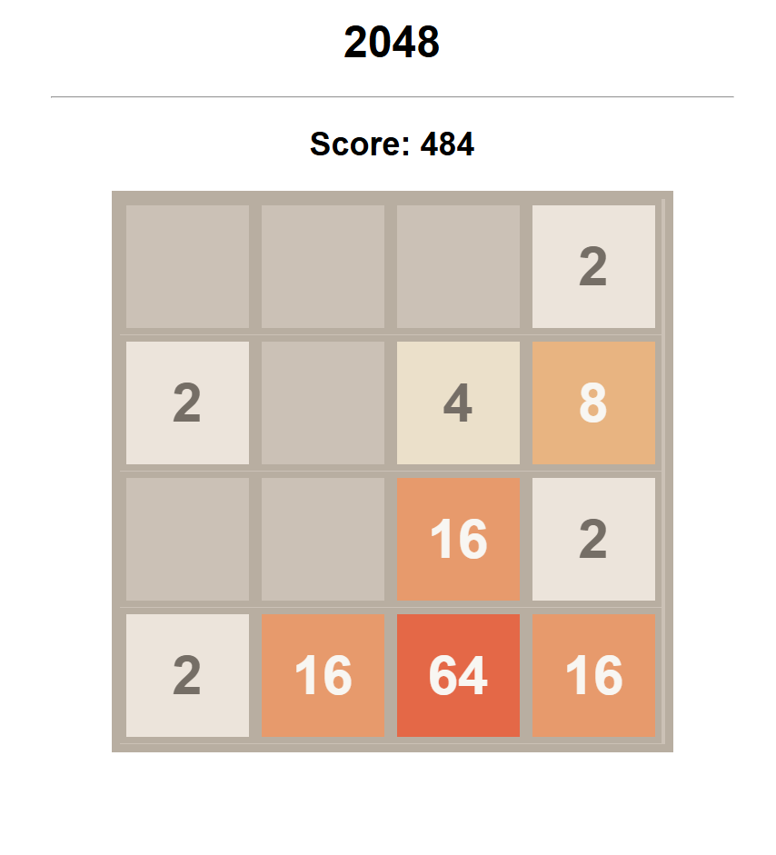

# 2048

2048 is a single-player sliding tile puzzle video game written by Italian web developer [Gabriele Cirulli](https://en.wikipedia.org/wiki/2048_(video_game)).

2048 is played on a plain 4×4 grid, with numbered tiles that slide when a player moves them using the four arrow keys. The game can be run here [macinj1.github.io/2048/](macinj1.github.io/2048/).

